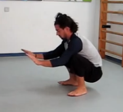
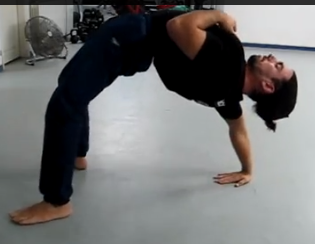
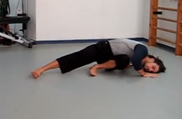
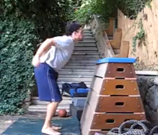

#Support Holds (do both holds)
**The Swedish Bars Front Support** 10-30s hold / 5 sets / 45-90s between

This is a basic exercise used in gymanstics as a basic body tension preparatory drill. I have heard that in some ex-USSR countries kids 6-7 years old are required to stay for 3 min in this position...
Stand on the lower bar of a swedish ladder. Grab the bar at around your waist height with a pronated grip (thumbs pointing in, later on in more advanced stages it can be done with a supinated grip also) and support yourself on top of your hands.
Make sure your shoulders are pushed down, and activate your butt and abs. Slowly take one foot and point it down. Add the other foot - for the complete support. (your whole body is supported on your hands)
The tension in the muscles around your armpit is the secret here - upper back, rear delts and triceps join to create a lock of tenstion, and though, helping support your body, even though the body is not on top of the supporting point (hands) - which is excatly the point.

**The Swedish Bars Back Support** 10-30s hold / 5 sets / 45-90s between

The back support is a harder exercise than the front one.
Step on the lower bars of the swedish ladder with your back to the bars.
Grab the bars at about waist high with a supinated (thumbs out) grip.
Make sure you 'hollow' your upper back a bit by rounding the shoulder forward and putting a small curvature into your upper back.
Extend one leg down, contract your butt and abs, push down with your shoulders and join the other leg to complete the position.
This exercise, at first, will seem impossbile to some. Keep playing with the positioning, go over the details again and correct your body alignment. With practice, you will get it, I assure you.

`Both support positions can be performed with some help from a partner - glueing you to the bars, first with a lot of help and later on, once you learn how to create the needed body tension - a two fingers assistance only. You can also use an elastic band to keep yourself glued to the bars, if no partner is available. Work at it, devote some time to these basic support positions, and you will see improvement in many other areas of your physical development.
Especialy helpful is the front support to the front lever position, as well as the back support and the maltese/planche positions.
The exercises should be performed for 5-30 sec holds, once it is easy to work with 30 sec sets, you are ready to graduate to more advanced exercises.`

#Tripod Headstand Press
Gatherings (this is a military term in Hebrew I use to describe various forces/troops comming together to one point on the map) are somewhat of a basic strength or strength endurance exercise with some lower back, shoulder and triceps components to it.

**Gatherings - Beginner** 10, 8, 6, 4, 2 reps / 75s, 60s, 45s, 30s rest

 

1. From a squat, go into a frog stand, lower with control towards your head and come back for reps.
2. Exactly like number 1 only when you reach with the head to the floor, extand into headstand.
This will strengthen you and prepare you for the intermidiate variations. Practice it.

**Gatherings - Intermediate** 10, 8, 6, 6, 6 reps / 60s, 60s, 45s, 45s, 45s rest

 

1. Stage A - From a headstand, bend knees and take your heels towards you butt. Stage B - bring knees into your chest. Stage C - Bring feet to touch the floor. Reverse the order and repeat for reps.

2. The same like 1 only with straight legs the whole way. This is called Reverse Leg Lifts in Gymnastics circles. Very good antagonist work for high bridging - lower back gets a good stretch with each rep in a dynamic fashion similar to the counter stretch in Rotations Into High Bridge.

**Gatherings - Advanced** (requires freestanding handstand) 10 reps / 5 sets / 45-90s rest

From a headstand complete the downward phase of Gatherings-Intermidiate variation 2 and from there, using the momentum created by the lifting legs, extand into a handstand. Come back down to head stand and repeat for reps. Of course you will need good freestanding Handstand ability to use this excelent exercise. Another good reason to work on your Equilibre skills.

#Bridge Work

**Basic Bridge Push Ups** 10, 8, 6, 4, 2 reps / 0-30s rest

 

This is the basic variation. Lay on your back, bring your heels close to your butt and place your hands, with fingers pointing at your feet, under your shoulders.
Push up into the highest back bridge you can reach, hold momentarily and lower down, trying to bring your butt and shoulder blades at the same time to the floor.
Repeat for reps.
Notice that unlike other performers of this type of push ups I use the full range of motion - back on the floor to complete elbow lockout. You should do the same for maximum results.

**One Leg Bridge Push Ups** 10, 8, 6, 4, 2 reps / 0-30s rest

 

This variation will require more control and strength in the posterior chain (hams, glutes and lower back) and will place a higher demand on your core muscles.
I like to use this variation especialy because it transfers so well to various Floreio movements. (I have not shared those movements yet)
Basicly, perform the same bridge push ups, only with one leg extended straight and held off the ground. The same details as the basic variation apply here also. Full range of motion.

**One Arm Bridge Push Ups** 10, 8, 6, 4, 2 reps / 0-30s rest

 

This variation will place higher demands on your arms and shoulders as well to a host of muscles running across the upper body that will get activated here as stabilizers, due to the lack of support from the free arm.

From the basic starting position, use only one arm to push up into a one arm back bridge. Hold momentarily and lower down under control.
This variation can be out of reach to some people due to a lack of active flexibility and strength in many areas in the body. Work the basic bridge push ups variations for a while before you try to tackle this one.

#Core

**Swedish Bench Hanging Leg Raises** 12, 10, 8 reps / 45s rest

 

Installing the Swedish Bench in the proper height allows for fine tunning of the exercise intensity until the full vertical variation is possible. Keep increasing the height of the bench anchor point with time. A rep counts as a rep only when you touch the bench with your feet.

**0-90 Hanging Leg Raises** 5 reps / 3 sets / 120s rest

 

Once vertical HLRs are possible, one possibility is to concentrate on the upper half of the movement - performing 0-90 Degrees Hanging Leg Raises, starting in a hanging L-sit and going up to the bar and back.

**One Arm Hanging Leg Raises** 5 reps (per arm) / 3 sets / 120s rest

 

Once vertical HLRs are possible, one possibility is to concentrate on the upper half of the movement - performing 0-90 Degrees Hanging Leg Raises, starting in a hanging L-sit and going up to the bar and back.

Simple but not easy. If you are able to perform HLRs but not the one arm version, I suggest you concentrate on increasing the number of reps, until 5 is achieved, then add a static pause at the top, until 5 sec is possible in all 5 reps, then add weight. In addition, start to play with one arm hangs from the pull up bar - up to sets of 30-45 sec. This combination will allow you eventualy to progress to the one arm version.

#pulling

**90-90 Iso Pull Up Hang** 10-20 sec / 5 sets / 60-90 sec rest

10-30s / 5 sets / 60-90s rest between

This is a very good static position to concentrate on, (along with other pulling static positions that will be introduced in the future) that combines upper arm, back, hip flexor and core challanges.
Basicly, hanging from a high bar, in a supinated (chin up) or pronated (pull up) grip, bend the elbows in a 90 degrees angle, and lift your knees or full extended legs in a 90 degree angle to your body. Hold the position for the required amount of time and come down.

**90-90 One Arm Iso Chin Up Hang** 5-15 sec per side, resting 10 sec in between sides / 5 sets / 60-90 sec rest

5-15s per side / rest 10s between sides / 5 sets / 60-90s rest between sets

This is a more advanced version - using only one arm to hold in position. A special attention should be given to stop the rotation of the body inwards - hold the position facing the front and using a chin up supinated grip.
To work towards this skill, use a short rope hanging from the pull up bar - and hold it with the free hand to assist you. The lower you grab, the less help you get.

#Pushing

The NDA is a very traditional movement, hundreds of years old, that originated in traditional Capoeira practice and nowdays in Capoeira Angola mainly.
This movement imposes great demand, in its various forms of practice, and used for endurance/strength development in a lateral position - non traditional position.

**Negativa de Angola Lateral Push Ups** 10 reps / 3 sets / 30s rest

  

From a squat position, place one hand behind your heel and the other hand in front of the toes of the same foot. While you do that, straighten the opposite leg completely, and start lowering towards the temple of your head. The only thing that should touch the floor is the outer edge ('knife') side of your close foot, the other foot, your hands and the temple of your head-lightly. The elbow of the hand behind your back will not be placed under your body like in QDR, but instead, your body will be lower than your elbow - in a position called Vasamento - lower than QDR!

**Negativa de Angola Lateral One Arm Push Ups** 10 reps (per side) / 3 sets / 30s rest

  

Same as the beginner, but with only one arm.

Take notice, nothing should touch the floor but the things I have mentioned above. This requires some mobility around the squat position, in the hip rotators and more. This movement can be difficult at first for some people, and some getting used to is in order.

#Explosive Leg Work (do both standing and squat combos)

**Jump Onto Box From Standing** 8 reps / 3 sets / 90 sec rest

  

Stand in front of a box from knee to head high, create a small knee bend, swing your arms and jump into the box, landing in a squat position on top of it. Come down, leg by leg or jumping down and repeat for reps.

**Jump Onto Box From Squat** 8 reps / 3 sets / 90 sec rest

  

Stand in front of a box from knee to head high, squat down and hold without moving for 3-5 seconds. Explode from the squat up and into the box, landing in a squat position on top of it.
Repeat for reps.

**Front Flip - Standing** 5 reps / 3 sets / 90 sec rest

   

Stand with an erect body. Swing your arm up and behind your head and initiate a front flip while trying to jump up and tuck hard. Soften the landing, trying to land in place. Front flipping from punching is very different from this. The standing front flip requires a lot of explosive strength in the legs and abdomen because of the way our body is build. It is much easier to initiate a back flip from standing than a front one - one only needs to compare the posterior chain to the anterior body muscles.
Repeat for reps

**Back Flip - Iso Squat** 5 reps / 3 sets / 90 sec rest

    

Squat down, taking both arms forward. Pause for 3-5 seconds, swing your arms while jumping explosively into a back flip. Try to stick the landing, softening into it. Repeat for reps.
Do not let the squat position at the start of the exercise to change the 'triple extenstion' in your calf, knee and hip from occuring due to different timing. Make sure you completely extend upwards before tucking into the flip.

#Shrimp Squat

**Beginner** 5 reps (per leg) / 5 sets/ 90s rest

  

The easiest variation starts in the kneeling position one leg behind you placed from knee to foot on the ground.
Balance yourself with the hands forward, pull forward and up, while pushing into the ground with your active leg. Reach a standing position on one leg, lower down the same way and repeat for reps.

**Intermediate** 5 reps (per leg) / 5 sets/ 90s rest

 

The intermidiate variation will be exactly the same, apart from one difference - the back leg is only touching the ground with the knee. (the foot is lifted in the air)

**Advanced** 5 reps (per leg) / 5 sets/ 90s rest

  

The advanced variation will be to grab ahold of the back foot in a quad stretch position and slowly while pulling forward and up and using no momentum, stand up. Come down the same way and repeat for reps.

The advanced variation is the hardest body weight exercise I ran into until today. I dont need to take my shoes off to count the number of people I have witnessed performing this correctly (no momentum and in the correct positioning) and I have challanged some heavy squaters and heavy pistol practitioners.
The reason is a the bad mechanical advantage of the movement of course. Try it, it is a humbling experience.
Having said that, it is not the hardest variation of the exercise... but we will leave something for the future!

#Harop Curl

The Harop Curl or Natural Hamstrings Curl is another brutal bodyweight leg exercise, concentrating on the back of the leg, and especialy the hamstrings muscle group. (Other muscles active here are the Gastrocnemius, Glute, lower back and counteless other small muscles)

**Beginner** 5 reps / 5 sets/ 90s rest

 

Kneel down on your knees with your feet anchored below a heavy object / someone standing on your soles while you point your feet behind you.
If you are a feeling some knee strain feel free to cushion your knees.
The beginner variation will be to break the angle of the knee and lean forward a bit. When you feel you cannot go further anymore, start to break the angle at the waist and touch your nose to the ground/bench. Return to upright kneeling position and repeat for reps.

**Advanced** 5 reps / 5 sets/ 90s rest

 

The advanced variation will include a more acute angle forward in the knees and a minimum break in the chest to knee line.
This is a simple exercise but not an easy one. Expect some serious cramping of the back of the legs, and aproach it with caution. Do not try to go for advanced variations too soon.

#Full Body Conditioning Combinations

This is a combination I created a long time ago as a conditioning movement that combines upper body, lower body and core (mostly in the advanced variation - due to the lifted front leg) into one small piece of flow.

**Eccentric Pistol + Side Push Up - Beginner** 10, 8, 6, 4, 2 (per side) / 0-30s rest

    

The easy variation starts while standing on one leg. Make sure your weight is concentrated on your heel, lower back and down into a one leg squat, making sure the heel doesnt come up, and that the hand of the same side of the raised leg is waiting to recieve the floor. When you reach the bottom of the Pistol Squat, lower your foot to the ground, but do not let any other part of your body besides you hand and both feet touch the floor. Lower down to the side push up, letting your body pass the elbow line and into 'Vasamento' position. Push back up. Pull the straight leg back into a normal squat. Stand up. Repeat for reps.

**Eccentric Pistol + Side Push Up - Intermediate** 10, 8, 6, 4, 2 (per side) / 0-30s rest

   

The intermidiate variation will be only a bit different from the beginner one:

1. No help from the hand during the decent into the pistol.
2. One Arm Side Push Up and not two.

**Eccentric Pistol + Side Push Up - Advanced** 10, 8, 6, 4, 2 (per side) / 0-30s rest

    

The advanced variation will be even more challanging than the intermidiate:

1. Lift the whole leg that is free from the start and during the whole exercise and make sure it is still hovering above the ground in the one arm side push up.
2. A concentric lifting out of the pistol position is added - not only decent on one leg but also comming back up on one leg.